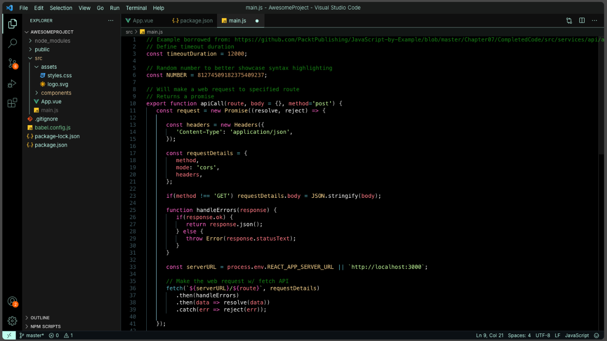

# Blvck Theme

Blvck is a sleek and modern VS Code theme that highlights the deep and calming tones of black. The theme is designed to enhance focus and reduce eye strain during long coding sessions. With its dark background and coffee-inspired accent color, Blvck brings a touch of elegance to your coding environment.

## Key Features

- **Dark Background:** A rich, dark background that reduces glare and improves readability.
- **Accent Color:** `#C0FFEE` – A pastel blue inspired by hex code of #c0ffee, adding a subtle warmth to the overall cool theme.
- **Black-Dominant Color Palette:** Shades of black are primarily used for syntax highlighting, ensuring a consistent and soothing visual experience.

## Installation

1. Open the Extensions sidebar in VS Code.
2. Search for Blvck Theme
3. Install and activate the Blvck theme from the theme menu.

## Screenshots

## Contributing

Feel free to submit issues or pull requests to enhance the theme further.

---

Enjoy coding with the calming and focused Blvck theme!
